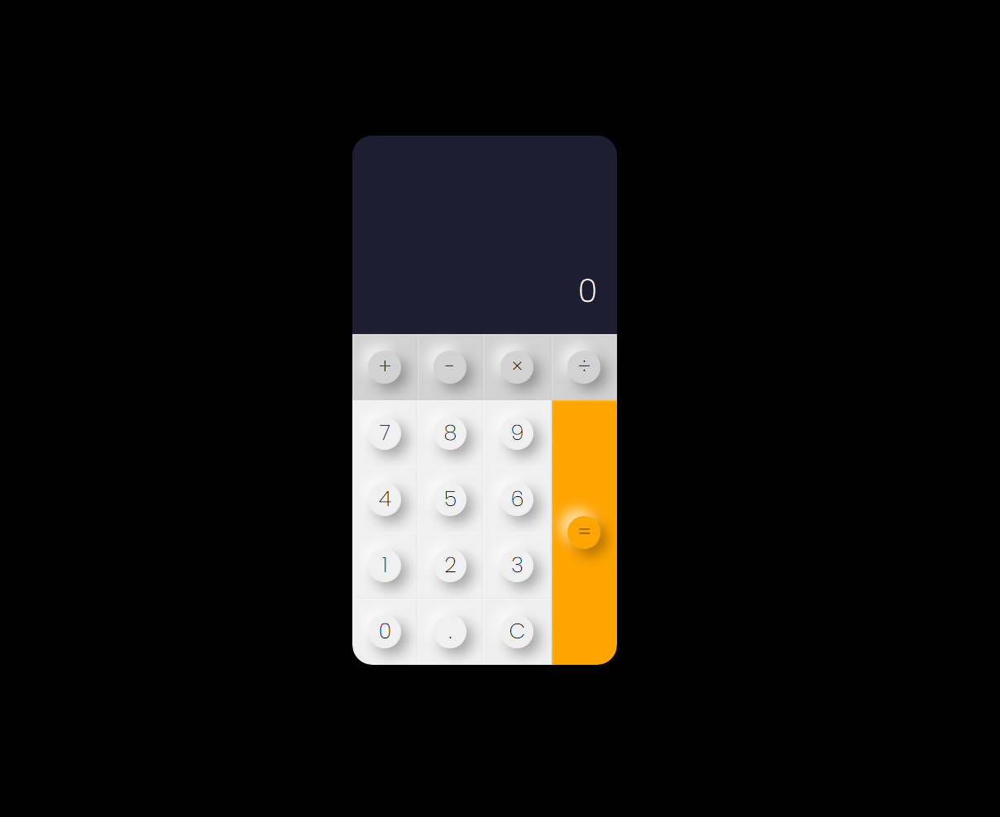

# Neuemorphic Javascript Calculator

This project is a simple calculator written in vanilla Javascript. It
has a 'neuemorphic' style interface made with HTML/SCSS. It takes some
design inspiration from the Teenage Engineering OP-1.

<!-- You can find this hosted at kchn.com.au/jscalculator -->

## **Contents**

-   ## [Project Brief](#project-brief-1)

-   ## [Design](#design-1)

-   ## [Technical Implementation](#technical-implementation-1)

-   ## [Project Reflection](#project-reflection-1)

---

## Project Brief

### Aims

The goal of this project is to reinforce learning in a few areas.

**Javascript**

I wanted to gain further experience managing complex logic trees and
working with DOM interaction.

**Javascript Modules**

I wanted to try out organising my code into modules and enforcing the
idea of pure functions as a way to create cleaner code.

**Unit Testing and TDD**

I also wanted to try out test-driven-development as a way of
organising a code-base and making sure I fully understood how my
program worked before I started implementing my ideas.

### Minimum Viable Product

**HTML/CSS**

-   Create a calculator to be rendered on the HTML page.
-   It should have number keys from 0-9.
-   It should have operator keys (+, -, \*, /)
-   It should have a display rendering the current calculation in a
    box at the top.
-   It should also have a "." key

**JavaScript**

-   Should render the current calculation in a box at the top.
-   It should handle decimals.
-   It doesn't need to support orders of operations.
-   It should not use eval() or Function() constructor.

## Design

The calculator was inspired by the OP-1, designed by Teenage
Engineering.

_The Teenage Engineering OP-1 pictured in the middle. From Ville
Hyvönen on Wikimedia Commons._

## Technical Implementation

### Javascript

**File Structure**

The javascript files were structured like so:

    index.html
        js/
            modules/
                module.js
                module1.js
            main.js
        tests/
            modules/
                module.test.js
                module1.test.js

**Writing and using unit tests**

There were three pure functions in this application, all related to
processing the inputs and parsing them as math operations. They were
each designed while writing the unit tests to make sure that they
received and returned the proper data and sanitised their inputs when
appropriate.

When coding them, they were tested until they satisfied all the tests.

**Using element.dataset for interaction logic**

I ended up using data attributes to help program the core logic of the
program. This allowed me to only add one event listener to the
container of all the buttons. I then used a combination of states
stored in the parent div as data attributes as well as on each button
to lay out the logic tree of the interaction

    data-current-operator:
        none: no current operator
        plus, minus, times, divide:
            this one has been pressed

    data-button-type: the type of button
        that was just pressed e.g.
        operator, number, equals, decimal, clear

    data-clean: true or false
        This is useful so we know when to
        accept certain inputs e.g reject
        operator presses when there is no
        previous result.

**Using element.textContent for displaying and processing inputs**

Using the textContent property of each button element was a very easy
way of putting interaction events onto the display. However you should
be careful using this property because it also grabs the whitespace in
the html file as well. I fixed this by setting putting
`"prettier.htmlWhitespaceSensitivity": "strict"` in the workspace
settings.json file.

**Evaluating Expressions**

Since I am limited by not being able to use `eval()` or the
`Function()` constructor, I needed to find my own solution to taking
user inputs and outputting a final result. I used three different
functions to return the final string that would be the result of the
user-inputted maths operation. The choice to split operations up to
such granularity was two pronged; I wanted a chance to implement
test-driven-development as much as I could, and I wanted to separate
the concerns as much as possible.

On pressing of the '=' button, I grabbed the textContent of the 'p'
tags that displayed the numbers. This returned an array of strings
that I passed onto the first function:

1.  The first function evaluated those strings to determine if the
    previous result should be part of the evaluation. If the previous
    result was `120` and the user inputted `+10`, then the previous
    result is needed. However if the input is its own self-contained
    maths operation: `120+10`, then only the current input is passed
    on as a string.

2.  The second function turns the string that it is given and turns it
    into an array of numbers and instructions in the form of strings:
    `[120, 'plus', 10]`. Since it needs to return valid numbers and
    instructions, this function will strictly sanitise its input and
    throw an error if it receives errant inputs.

3.  The third function takes that array of numbers and instructions
    and loops through them, almost like a `reduce()` function. It adds
    a number to an accumulator variable. Then as it comes across an
    instruction (like 'plus'), it will save that in another variable.
    It will then perform a math operation: the accumulator variable,
    the current operation, and the next number in the array. E.g:

        accumulator = 120;
        currentOperation = 'plus';
        // next number in array:
        num = 10;
        // we then do this:
        accumulator = accumulator + 10;

### Thoughts

The test-driven development for the three expression evaluation
functions was helpful in keeping my thoughts organised and prevented
me from having to redesign the function as I write it.

Thanks to the testing requirements that I wrote for myself, I ended up
with an application with many layers of error handling, even when the
previous function should have handled the same exception. But I think
an application designed like this is more robust and has a better
chance of surviving feature changes and code maintenance.

I received some feedback saying that my code was logic-heavy, meaning
that one would need to dive into functions in order to decipher what
they were doing. A better programmer might have used more explicit
variable names and more human-readable design design-patterns.

## Project Reflection

Overall the project satisfies the MVP. I think the visual design could
be more similar to the inspired product, however I feel like the
current iteration looks good.

I do want to look into giving the calculator more features. I like the
idea of having it evaluate expression while also respecting order of
operations. I also want to give some feedback to the user when it does
something that the code doesn't allow (e.g. a red outline when the
user tries to add a number with nothing).
